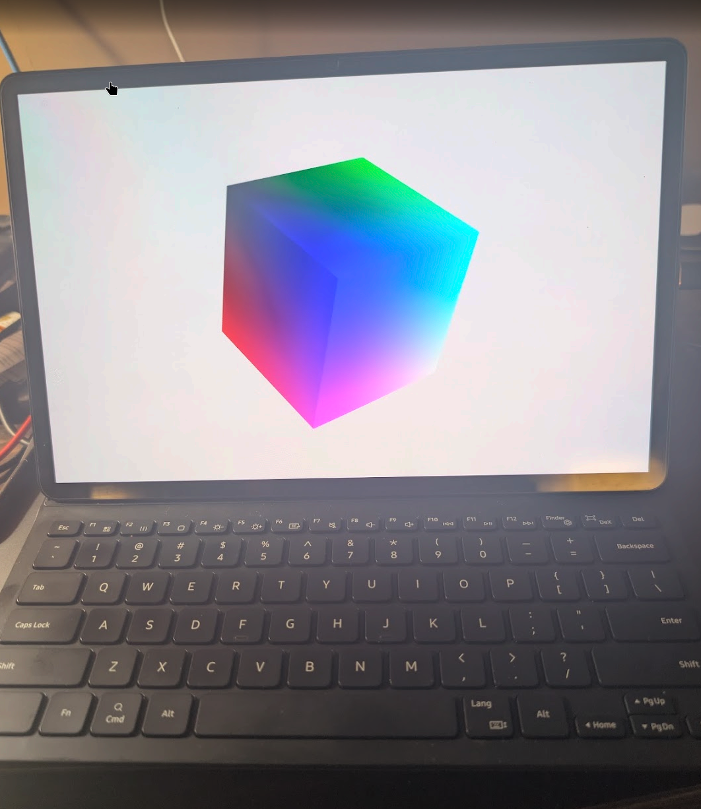
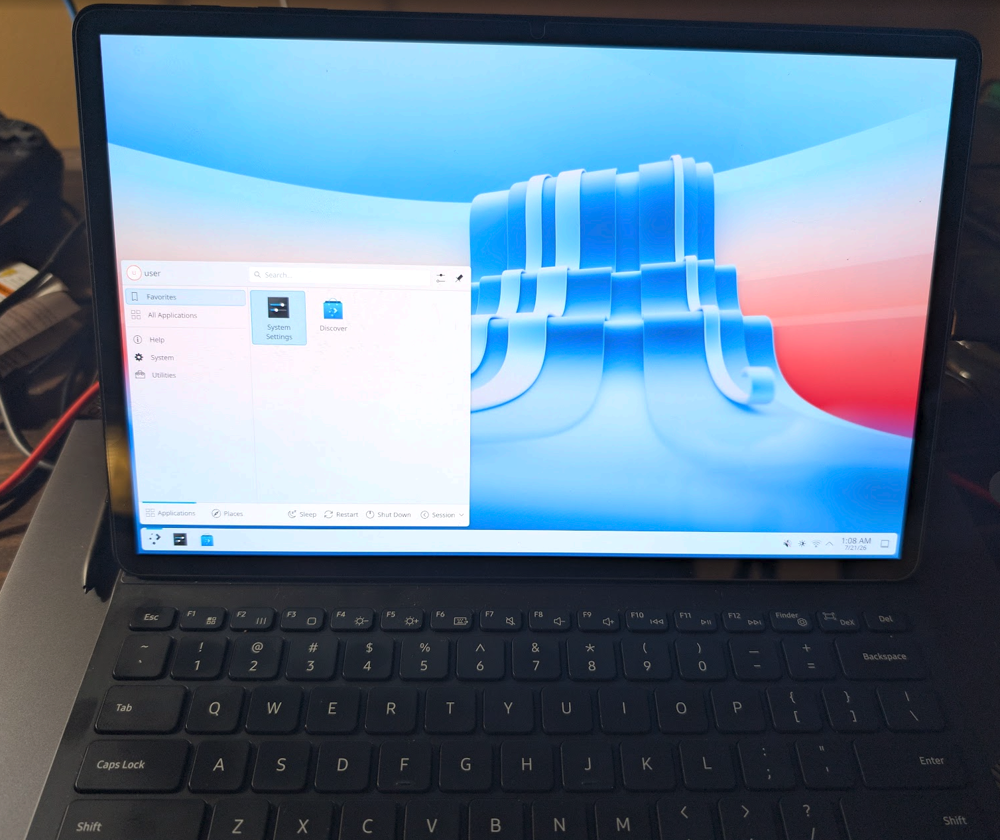
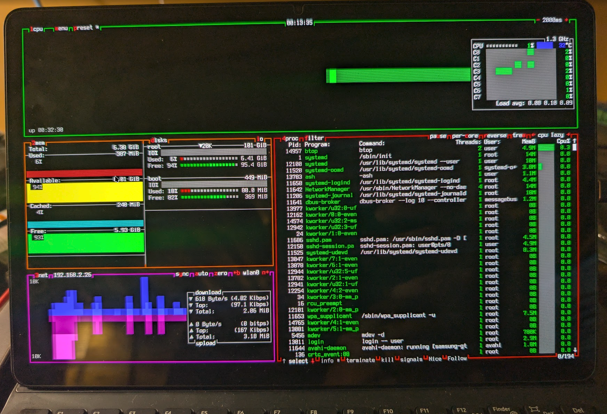

# Samsung Galaxy Tab S8+ (SM-X800) — mainline Linux / postmarketOS port

Mainline Linux runs **usably** on the Galaxy Tab S8+ Wi-Fi (`gts8pwifi`, Qualcomm
SM8450 "Waipio"): kernel 6.13-rc3, all 8 cores, a **native KMS display driver**
(our S6TUUM1 panel driver — DSC, 120 Hz, real power management) on the 2800×1752
OLED, root on UFS, **WiFi with ssh**, **Bluetooth**, **touchscreen**, and the
**Book Cover Keyboard** — you can log in at the panel and type on the real
keyboard, or ssh in over WLAN with no cables at all.

No Galaxy Tab S8 port exists upstream — as far as we can tell this is the first.



*kmscube on `FD730` (freedreno, OpenGL ES 3.2) — hardware GL through the native
DPU/DSI/DSC pipeline, with the pogo Book Cover Keyboard doing the driving.*

> **Status: it's a Linux tablet now.** Boots through a quiet native display stack
> into **KDE Plasma 6** (KWin Wayland, composited on the Adreno 730), with
> touchscreen, keyboard, WiFi and Bluetooth all live — or stay on the pure
> console, which is equally at home. The big remaining gaps are audio and the
> long tail (S Pen, cameras, sensors).



| Component | State |
|---|---|
| Boot (uniLoader → mainline kernel) | ✅ working |
| Display — native KMS console (msm DPU/DSI/DSC @ 2800×1752) | ✅ working |
| CPU — all 8 cores | ✅ working |
| UFS storage — root mounted, auto-resized | ✅ working |
| Touchscreen (STM FTS1BA90A) | ✅ working — our `fts1ba90a` driver, orientation measured on-device |
| Book Cover Keyboard (pogo STM32 @ i2c 0x2a) | ✅ working — our `stm32-pogo` driver (keyboard, caps LED; touchpad supported but untested, the Slim cover has none) |
| WiFi (WCN6855, ath11k on PCIe0) | ✅ working — NetworkManager autoconnects at boot; primary ssh path. Carries the upstream RX-corruption fix trilogy (bulk downloads used to wedge with `msdu_done` errors / silent drops) |
| Bluetooth (WCN6855 on uart20) | ✅ controller up, firmware loads (`hci0`); pairing not yet exercised |
| USB host (xhci) | ✅ working |
| USB ethernet + DHCP + ssh | ✅ working (Realtek RTL8153 dongle) — now the fallback, not the lifeline |
| Power key, volume down (PMIC PON) | ✅ working |
| Volume up (pm8350 gpio-keys) | 🟡 dead — NOT an index bug: gpiomon watched every pm8350/pm8350c/pmk8350 line through presses, zero edges anywhere; needs schematic-level digging (pull-up rail / SPMI register poke) |
| `reboot download` from Linux | 🟡 PON `mode-download` wired but ABL ignores it — likely cold reset clears the spare bits (downstream forces a warm reset first); under investigation |
| USB gadget | ❌ needs Type-C/`pmic_glink` described |
| Native panel driver (S6TUUM1 DDIC) | ✅ working — full native KMS: cold init (Anapass TCON-ready handshake), DSC @ 2800×1752, TE-synced 120 Hz, DPMS blank/unblank, brightness (11-bit DBV). Story: device-facts/display-s6tuum1.md |
| S Pen (Wacom EMR digitizer) | ❌ not started (separate chip, separate bus) |
| GPU (Adreno 730) | ✅ working — freedreno/Mesa `FD730`, OpenGL ES 3.2; Samsung-signed zap from the `apnhlos` partition (`gts8pwifi-fw-extract`), firmware rides in the initramfs (a7xx loads SQE at bind time) |
| Plasma Desktop 6 (KWin Wayland) | ✅ working — full KDE 6.7 desktop, KWin composited on the Adreno, Plasma Login Manager autostart; one command on a fresh install: `sudo gts8pwifi-setup plasma`. Polish gaps: tear bands under fast motion (panel idles at ~24 Hz LFD), no runtime 120 Hz switching yet |
| Login experience | ✅ quiet boot (`loglevel=4`), generated `/etc/issue` banner with live IP (agetty needs `--issue-file` on Alpine), UTF-8 locale, keyboard autorepeat (kernel r42) |
| Audio | ❌ blocked twice over: ADSP firmware, and AudioReach has no MI2S/TDM path; no WCD codec / SoundWire on this board |
| Sensors (incl. auto-rotate) | ❌ architecturally blocked — SLPI-owned I3C with no mainline path |



*Daily-driver console: btop over UTF-8 fbcon — all 8 cores, WiFi, 95 GB root,
half a watt of load average.*

### Getting a shell

**Local:** attach the Book Cover Keyboard and log in at the panel like any laptop.

**Wireless:** the device autoconnects to its saved WiFi network at boot
(NetworkManager profile) and a bring-up service prints interface/MAC/IP/gateway to
the panel whenever they change — read the address off the screen and ssh to it.

**Fallback:** a self-powered USB-C ethernet dongle still works the same way, and
holding **volume-down from initial power-on** drops into the postmarketOS initramfs
debug shell (on-screen keyboard via osk-sdl).

## Should you try this?

If "mainline Linux with a real GPU on Samsung tablet hardware" makes you grin,
genuinely: yes, come on in — the water's weird but warm. Read this first, though,
because the door locks behind you:

- **Unlocking the bootloader permanently blows the Knox efuse.** Warranty gone,
  Knox/Samsung Pay features dead forever — even if you return to stock Android.
  There is no un-blowing it.
- **Going back to stock is possible but not painless.** Odin can reflash Samsung
  firmware (`make restore-android` documents our path), but expect friction, and
  Knox stays tripped regardless.
- **The unlock/root path has a firmware ceiling** — no later than One UI 7.0.
  If your tablet has already updated past it, this door may simply be closed.
  Details and the full runbook: `docs/01-unlock-root-runbook.md`.
- **This is a development platform, not a product.** No audio, no S Pen, no
  cameras, no sensors. What works, works genuinely well — native display, GPU,
  input, wireless — but you are signing up to be a porter, not a customer.

And a sincere off-ramp: if any of the above reads as risk rather than fun,
**Samsung DeX plus a Linux terminal/emulator app gets you a capable Linux
environment with zero risk and zero soldered-shut doors.** That is the sensible
choice. This repo is the other one.

Start with `docs/01` (unlock/root), then `docs/05` (the boot recipe).

## Why this is unusual

You **cannot** boot mainline Linux directly from Samsung's bootloader on this SoC.
Samsung's ABL merges its own device-tree overlay fragments onto whatever DTB it
selects, which corrupts a mainline device tree — the kernel then dies before any
console exists, giving you a completely silent failure.

The fix is [**uniLoader**](https://github.com/ivoszbg/uniLoader), a secondary
bootloader that embeds the kernel, DTB and ramdisk inside its own binary and
masquerades as a kernel image. Samsung's ABL only ever sees "a kernel" and never
touches our device tree. (`lk2nd` does not support SM8450.)

The full story — including the seven separate silent failures it took to get a
console — is in [`docs/05-mainline-uniloader-boot.md`](docs/05-mainline-uniloader-boot.md).
If you are porting another Samsung SM8450 device, read that first; it will save you
a lot of blind reboots.

## Layout

```
docs/                     Findings, runbooks, and the boot-debug history
  00-recon-findings.md      Device recon
  01-unlock-root-runbook.md Bootloader unlock + root
  02-pmos-port-prep.md      Downstream port prep
  03-boot-debug-log.md      Why the DOWNSTREAM kernel path failed (dead end)
  04-mainline-prep.md       Pivot to mainline; visibility keys from the stock DTB
  05-mainline-uniloader-boot.md   ★ the working recipe + every bug and fix
  06-upstreaming.md         Conventions, versioning, contributing back
  07-input-and-wireless.md  Touch + keyboard driver ports, WiFi/BT bring-up
  08-native-display.md      Native KMS: DPU/DSC bring-up and the Anapass TCON
pmaports-overlay/         Our postmarketOS packages (the actual port)
  device/testing/linux-postmarketos-qcom-sm8450/   kernel pkg: DTS, config, DPU DSC
                                                   patches, and four drivers written
                                                   from Samsung's GPL downstream —
                                                   fts1ba90a.c (touch), stm32-pogo.c
                                                   (keyboard), max77705-otg.c (VBUS),
                                                   panel-samsung-s6tuum1.c (display)
  device/testing/device-samsung-gts8pwifi/         device pkg + deviceinfo
  uniloader-port/                                  our uniLoader board port
device-facts/             Non-proprietary device documentation
tools/                    Runbooks + helpers: mkpatch (patch workbench),
                          post-flash procedure, hard-won gotchas
Makefile                  Build/flash automation (make help; boot builds run
                          the stage-fw gate and end with the bring-up manifest)
```

Not in git (see `.gitignore`): `pmb-work/`, `kernel-src/`, `reference/`,
`root-build/`, and all Samsung firmware (stock partition dumps, stock DTBs). Those
are Samsung's copyrighted binaries and stay local.

## Building

Requires [pmbootstrap](https://postmarketos.org/pmbootstrap), `odin4`,
`android-tools` (mkbootimg/unpack_bootimg/img2simg), and `dtc`.

First run only — point the vendored pmbootstrap at this repo and device
(everything lives under the repo; nothing touches your home directory except
pmbootstrap's own config file):

```sh
./pmb init      # work path: <this repo>/pmb-work
                # channel edge, device samsung-gts8pwifi (ours), UI console
```

Then:

```sh
make deps       # clone uniLoader (pinned), apply our board port, chroot toolchain
make boot       # kernel -> uniLoader -> boot.img -> flashable tar
make flash      # odin4 the boot image (device in download mode)
make help       # everything else
```

`make rootfs` prompts for the device user password unless you pass
`PASSWORD=...` (the docs use throwaway credentials throughout — pick your own).

`make boot` runs `stage-fw` first (stages the locally-extracted GPU zap into the
build chroot's initramfs and hard-fails if it does not land) and ends by printing
the numbered bring-up manifest.

Rebuilding the rootfs as well is a longer path, because the rootfs UUIDs are baked
into the DTS bootargs (uniLoader passes no kernel cmdline of its own):

```sh
make rootfs     # pmb install; preserves the image and prints the new UUIDs
                # ...update pmos_boot_uuid / pmos_root_uuid in the DTS to match...
make boot       # rebuild kernel + uniLoader with the new UUIDs
make flash-all  # boot AND userdata in ONE odin session (no reboot between)
make flash-stay # same, but come back up in download mode for the next round
make uuids      # compare the rootfs UUIDs against what the DTS currently says
```

`make uuids` is the cheap sanity check — a mismatch there is the single most common
reason a freshly flashed system drops to the initramfs debug shell.

## Flashing gotchas

These cost us many cycles — see `docs/05` §5:

- **The device must be in a freshly entered download mode.** A session that has sat
  through boot attempts fails with `FAIL! (Auth)`, and the *"an error has occurred
  while updating the device software"* screen is a "fake download mode": it
  enumerates as `04e8:685d` and `odin4 -l` finds it, but it will not accept a
  flash. Entry choreography and recovery details: `docs/05` §5.
- **userdata must be a sparse image** (`img2simg`). A raw ext4 image fails at ~3%
  with `Fail request receive 3`.
- **userdata must hold the *combined* image**, i.e. `pmb install` *without*
  `--split`. The pmOS initramfs needs both a `pmOS_boot` and a `pmOS_root`
  subpartition, and our real boot partition is occupied by uniLoader — so both have
  to live inside userdata. Flashing only the split `-root.img` leaves no `pmOS_boot`
  and stage-1 stalls forever in `wait_boot_partition`. See `docs/05` §8b.
- **Press Power** at the "press power button to confirm unverified firmware boot"
  prompt or the kernel never runs.
- **Flash multiple partitions in one `odin4` invocation** (`-a` and `-u` together,
  as `make flash-all` does) rather than calling odin twice — that is what caused the
  reboot between writes. `--reboot` is opt-in, and `--redownload` returns the device
  to download mode for the next round.

Only `boot`, `vendor_boot`, `dtbo`, `vbmeta` and `userdata` are ever written.
**Never** flash bootloader or secure-world partitions (`xbl`, `aop`, `tz`, `abl`,
`pmic`, …) — Samsung download mode is the only recovery floor on this device
(EDL/9008 is not viable: it needs a Samsung-signed SM8450 Firehose loader that is
not publicly available).

## Credit

- [uniLoader](https://github.com/ivoszbg/uniLoader) by Ivaylo Ivanov — the piece that
  makes this possible.
- [sm8450-mainline](https://github.com/sm8450-mainline) — kernel tree and SM8450 config.
- `sm8450-samsung-r0q.dts` (Galaxy S22) — the skeleton this port started from.
- [postmarketOS](https://postmarketos.org).

## License

Port sources (DTS, board file, packaging) follow their upstream projects:
GPL-2.0-only for kernel/uniLoader sources, MIT for the pmaports device package.
