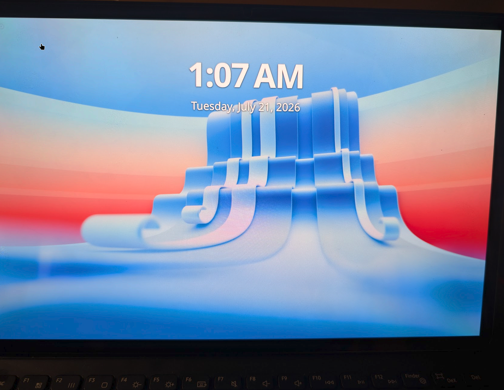

# Phase 8: the native display — DPU, DSC, and an Anapass TCON

Where phase 7 ended, the panel was still scanning out the bootloader's
framebuffer via simpledrm: fine for a console, but no power management, no
brightness control, no path to GPU compositing. This phase replaced it with
the real thing: `DRM_MSM=y`, our own `panel-samsung-s6tuum1` driver, and the
full DPU → DSI → DSC pipeline at 2800×1752/120 Hz.

It took nine flashes (r30–r38) and produced three genuinely instructive bugs.
The full technical detail lives in `device-facts/display-s6tuum1.md`; this is
the narrative and the lessons.

## The setup

The S6TUUM1 DDIC runs DSI command mode with DSC 1.1 (two 1400px slices per
line, PPS delivered via a vendor DCS register 0x9E, not the standard PPS
packet). The stock DTB's `qcom,mdss-dsi-on-command` stream gave us the whole
init sequence; `drm_panel` + `mipi_dsi_multi` made the driver itself small.
The DTS additions were mdss/dsi0/dsi0_phy with their rails, the panel node
(one fixed regulator on tlmm 34, reset on tlmm 0, TE on gpio 86), and
`CONFIG_DRM_MSM=y` (plus `python3` in makedepends — the register headers are
generated).

## Bug 1+2: the 2×2 console and the 96 ms kickoffs (one bug wearing two hats)

First light (r34, see below) showed the console as four perfectly legible
copies in a 2×2 grid, and every frame went out on a 96 ms timeout with
"prepare for kickoff" errors. We initially catalogued these as two bugs —
a DSC geometry mismatch and a TE-routing failure.

They were one bug. Our kernel snapshot (next-20241220) caught the upstream
DSC topology rework **mid-flight**: `dpu_encoder_prep_dsc()` was already the
finished, num_dsc-aware version, but `dpu_encoder_use_dsc_merge()` still
hardcoded `num_dsc = 1` — so with two DSC encoders reserved, the hardware
got `DSC_MODE_SPLIT_PANEL` (dual-DSI split-panel framing) but never
`DSC_MODE_MULTIPLEX` (merge both halves onto one link). Each encoder was
programmed to own both slices while being fed one, and the pingpongs never
merged. The panel dutifully decoded a stream framed for a different
topology: 2×2 tiles. And because the encoders waited forever for pixels
that never arrived, `pp_done` never fired: ctl_start 9240 / pp_done **0**
in `core_irq` — every kickoff a timeout.

One backported hunk (upstream `b6090ffb30f3`: count the real `hw_dsc[]`
blocks) fixed both symptoms at once. ctl_start == pp_done from then on, and
the TE rd_ptr irq — which we thought was orphaned — registered and fired
normally. **Lesson: when a snapshot tree catches a refactor mid-series,
diff the specific function chain against upstream final before theorizing
about hardware.**

## The takeover experiment (how we separated panel from pipeline)

Before any of that was understood, r30–r33's cold init produced only black
screens and exactly 7 TE pulses. r34 was the discriminating experiment:
"takeover mode" — prepare/enable touch nothing, drive the ABL-initialized
panel as-is. It displayed immediately, proving the entire DPU/DSI/DSC
pipeline and isolating the fault to our reset+init path. That one flash
converted an undebuggable black screen into two independent, debuggable
problems. **Lesson: when a boot chain hands you working hardware state,
build a mode that borrows it — it splits the search space in half.**

## Bug 3: the TCON that boots

With the datapath fixed, cold init still produced a healthy-looking
pipeline (TE running, pp_done completing, zero DSI errors) and a black
panel. The break came from the stock DTB properties we had skimmed past:
`samsung,anapass-power-seq` and `samsung,tcon-rdy-gpio` (tlmm **gpio 1**).
This DDIC is an Anapass TCON — a controller that *boots* after reset, for
~330 ms (measured), and raises a ready pin when it will accept commands.
Downstream's sequence is: VDD on → LP11 → reset → **wait for TCON ready**
(flat 200 ms + poll up to 300 ms) → HS commands. Our init had been firing
10 ms after reset, straight into a booting TCON; every command silently
void — sleep-out, PPS, all of it — with nothing on the wire to show for it.

prepare() now mirrors the downstream wait (`tcon_rdy=1 after 331 ms` in
dmesg on first try), and cold init just… works. DPMS blank/unblank runs the
full power-down/re-init cycle correctly. **Lesson: grep the stock panel
node for every `samsung,*` property you did NOT port, and know what each
one does — the one you skip is the sequencing gate.**

## The postscript: "the display keeps going black" that wasn't the display

With init fixed the panel came up bright — then "went black" minutes later.
The pipeline was provably healthy (frames completing, DPMS on), and writing
brightness=4095 revived it. The DDIC's DBV register is **11 bits**
(downstream fills DCS 0x51 with DBV[7:0] + DBV[10:8]; the candela table
tops out at 0x7ff = 420 nits). Our driver advertised a 12-bit range, and a
saved-brightness restore service wrote 2048 — which wraps to DBV 0. A
perfectly black screen on perfectly working hardware. Byte order is
DCS-standard little-endian (stock `51 d8 0d`), which also retroactively
explained r34's "very dim" (the big-endian `_large` helper's swapped bytes
decoded to DBV ≈ 13). The driver now advertises max 0x7ff.
**Lesson: "display went black" has at least three unrelated causes on this
panel (TCON not ready, DSC misframe, DBV wrap) — check the cheap register
one before the exotic ones.**

## Where this leaves the port

- Native KMS console end-to-end; simpledrm era over. `panel-blank` now does
  real DPMS (true panel power-down) instead of zeroing a framebuffer.
- The DPU patches are two small files in the kernel package
  (`dpu-dsc-topology-wide-mode.patch`, `dpu-dsc-merge-count-blocks.patch`);
  both correspond to completed upstream work and should dissolve on the
  next tree bump.
- Not yet needed from stock: delayed display-on (no wakeup garbage seen),
  ESD recovery, runtime VRR (fixed 120 Hz).
- Next: retiring the `clk_ignore_unused`/`pd_ignore_unused` bring-up
  bootargs, and a compositor to put the GPU to work. (The GPU itself came
  up the same day: the Samsung-signed zap shader hid in the `apnhlos`
  partition — not vendor/, not modem/ — and a7xx's bind-time SQE load
  means all GPU firmware must ride in the first-stage initramfs. kmscube
  renders on `FD730`, OpenGL ES 3.2.)

## Postscript: the desktop

Same day, a few hours later: KDE Plasma 6.7 (KWin Wayland) composited on the
Adreno, installed onto the minimal image with one command
(`gts8pwifi-setup plasma`, Plasma Login Manager autostarting on boot).

