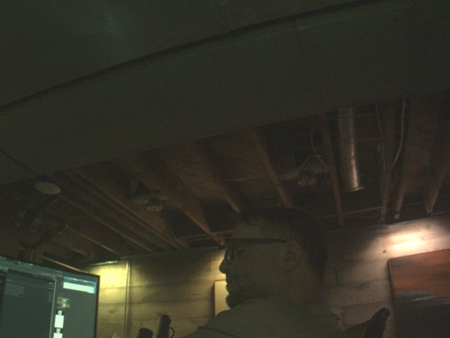
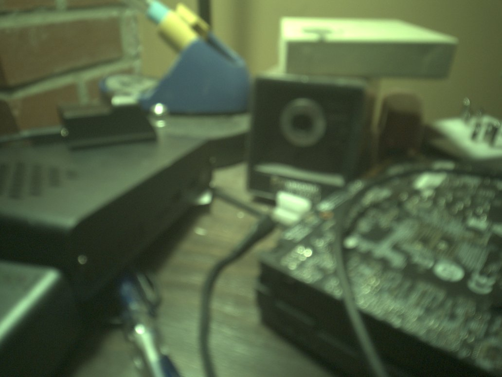

# Phase 11: cameras — CAMSS on SM8450 and a first frame from the ultrawide

Decision record: `docs/architecture/001-camera-stack-mainline-camss.md`.
Measurement record: issue #27. This page is the story of stage 1 and
stage 2 and stage 3, kernels r13 to r25 on 2026-09-21 and r29 on
2026-09-22.

## The hardware

Three Hynix sensors on the CCI buses, one lens actuator and one EEPROM on
a GENI I2C bus. Stock switches every sensor rail with a TLMM pin; there is
no PMIC LDO to name, only enables.

| | Rear main | Rear ultrawide | Front |
|---|---|---|---|
| Sensor | Hi1337, 4128x3096 | Hi847, 3264x2448 (stock reads 2896x2176) | Hi1337, 2032x1524 binned |
| I2C | 0x21, CCI0 master 1 | 0x21, CCI0 master 0 | 0x21, CCI1 master 1 |
| CSIPHY | 1 | 2 | 4 |
| MCLK | MCLK3, gpio103 | MCLK1, gpio101 | MCLK4, gpio104 |
| Reset / LDO enable | gpio120 / gpio107 | gpio106 / gpio109 | gpio24 / gpio25 |
| Lens, EEPROM | DW9808 0x0c, P24C256F 0x58 on GENI i2c2 | none, OTP | none, OTP |

All three share the I/O LDO enable on gpio117. MCLK is 19.2 MHz
everywhere. Power-up order on stock: I/O LDO, module LDO, MCLK, reset.
The facts come from the stock device tree and from the CamX sensor-module
binaries in the vendor partition of the stock image, decoded on
2026-09-21 (issue #27).

## Stage 1: CAMSS probes (r13)

Mainline 7.2 has no SM8450 entry in `drivers/media/platform/qcom/camss`,
so the plan was to write the tables from Samsung's GPL 5.10 source. The
register comparison shrank the job. The SM8450 blocks are csiphy-v2.1.0,
csid680 and vfe680, and 7.2 already drives csid680 and vfe680 for the
X1E80100 through `csid_ops_680` and `vfe_ops_680`. The X1E80100 csiphy
lane table is the downstream csiphy 2.1.0 table entry for entry, common
block at 0x1000. What remained was a `CAMSS_8450` version, the resource
tables, the switch cases, a binding and the camss node in `sm8450.dtsi`,
with registers, edge interrupts, GDSCs, SMMU stream IDs and clock rates
from the stock DTB. That is `sm8450-camss.patch`.

Two choices in the tables:

- `vfe_ops_gen3`, which the SM8550 uses, addresses RDI0 as bus write
  master 23. On vfe680 RDI0 to RDI2 are 24 to 26, so the 680 ops are the
  right ones.
- Full VFEs get three lines. The driver registers a fourth line as the
  PIX path, which the 680 ops would map to write master 27, LTM
  statistics on this hardware. Lite VFEs have four RDIs and get four.

The board DTS supplies the two CSIPHY rails (pm8350 L5B 0.88 V and L6B
1.2 V) and enables the node. On the tablet `qcom-camss` autoloads and
`media-ctl -p` lists 6 CSIPHY, 5 CSID, 3 full VFE with rdi0 to rdi2, 2
lite VFE with rdi0 to rdi3, 17 video nodes.

One flash lesson: kernel modules live in the rootfs. `dd` of boot.img
replaces kernel, DTB and initramfs; `/lib/modules` is whatever kernel apk
the rootfs has installed. The first r13 boot had the r2 camss module with
no sm8450 alias and nothing bound until the r13 apk was installed.

## Stage 2: the ultrawide streams (r14)

The mainline Hi847 driver is ACPI-only. `hi847-of.patch` gives it a
`hynix,hi847` compatible, vddio/vdda/vddd regulators, reset and shutdown
GPIOs, and runtime-PM power on and off around the clock, on the pattern of
hi846.c. The power sequence is the stock one: rails, 5 ms, MCLK at
19.2 MHz, 8 ms, reset released, 11 ms. The register tables are untouched;
the stock module's CamX tables differ from mainline's mainly in the sensor
MCU firmware image and in the cropped 2896x2176 window.

The DTS models the rails as two GPIO-switched fixed regulators, the shared
I/O LDO on gpio117 and the ultrawide LDO on gpio109 with the I/O LDO as
its `vin-supply`, which gives the stock enable order for free. `cci0` is
enabled, the sensor sits on `cci0_i2c0` at 0x21 with MCLK1, reset on
gpio106 active low, both link frequencies the driver requires (400 and
200 MHz), and its endpoint is wired to `csiphy2_ep` on the camss node.

On the tablet the sensor probes as `hi847 5-0021` with chip ID 0x0847,
already linked to `msm_csiphy2`. `tools/camtest.sh uw` links csiphy2 to
csid0 to vfe0_rdi0, sets SGRBG10 3264x2448 on every pad and captures with
`v4l2-ctl`: 10-megabyte frames at 29.7 fps, no camss or CSID errors in
dmesg, GDSCs back off afterwards. `tools/raw2png.py` unpacks the frame;
the raw values sit at the 64 black level with a full-range histogram.

*First frame from a mainline kernel on this tablet: the desk from the
ultrawide, half-resolution debayer, percentile stretch, no colour
correction.*

## Stage 2, second half: the second session (r23)

The first session after boot streamed; every later one failed. The camera
GDSC that had collapsed after the session, TITAN_TOP or IFE_0, never
reached power-up complete: `titan_top_gdsc status stuck at 'off'`, GDSCR
0x68282800, CFG_GDSCR 0x010e0000, then -22 on every attempt until a
reboot. A domain that collapsed after CCI traffic alone recovered, and the
lite path with no IFE domain broke TITAN_TOP too.

Eight kernel-side candidates went by, one per flash: the stock
retain-regs flag on the GDSCs, the SM8550 GDSC wait values, downstream's
CAMNOC qchannel handshake, holding the MMCX and MXC rails, collapsing the
IFE before gating its clocks, downstream's CSID path reset and quiesce, a
software-only CSID reset. None changed the outcome. camcc register dumps
in three states (`device-facts/camss-gdsc-2026-09-21/`) showed the
software-visible clock state identical before a working and a failing
power-up, with one exception that read as noise at the time: the RCG
selectors of the streamed clocks stayed on their PLL sources after the
collapse.

The bisect that found it ran at runtime. A module parameter skipped one
step of the VFE power cycle at a time in a throwaway power-up with no
links and no data, then a real stream followed. Skipping only
`vfe_set_clock_rates` made the next stream work. The rate setting is what
moves the camera RCGs from XO onto PLL0 and PLL3, and after the session
those PLLs are off while `ife_0_clk_src`, `csid_clk_src`,
`cphy_rx_clk_src` and `camnoc_axi_clk_src` still select them. The GDSC
power-up sequence waits on domain clocks that never toggle.
`drivers/clk/qcom/clk-rcg2.c` says so in the comment on
`clk_rcg2_shared_init`: an RCG stuck on a dead parent wedges the GDSC
"waiting for the clk status to toggle on when it never does".

camcc-sm8450 registers all 35 RCGs with `clk_rcg2_ops`, which leaves the
configuration in place when the branch goes off. camcc-sm8550 and
camcc-sm8650 use `clk_rcg2_shared_ops` for every RCG, which parks the RCG
on XO while disabled and restores the configuration on enable.
`camcc-sm8450-shared-rcg.patch` switches every SM8450 RCG to the shared
ops. With it, five consecutive sessions on VFE0 and VFE1 stream at 30 fps
and the RCG CFG words read 0 after each session. Stock never hit this
because its 5.10 clock framework parks RCGs on disable.

Two lessons carried into the invariants. Kernel module changes need the
kernel apk installed on the rootfs; boot.img alone does not carry them.
Skipping a clock in a bisect can hang the SoC when a register in that
domain is touched; the two hangs in this hunt came from skipping the CPAS
fast AHB and the VFE core clock while the IFE interrupt handler still ran.

## Stage 3: both Hi1337 modules stream (r24, r25)

Mainline has no Hi1337 driver. The Tab S9 port carries an out-of-tree
one (nacht20-de/gts9wifi-fedora, `hi1337_gts9u.c`), so the first
question was whether its register tables fit this tablet's modules. They
do not: the S9 init table shares 14% of its entries with the stock S8+
init table, the difference being the sensor MCU firmware in the 0x2000
region, and the S9 modules run a 360 MHz link where CamX drives these at
563.2 Mpixel/s, a 704 MHz link. So `hi1337.patch` is a new driver on the
hi847.c structure with tables generated from the stock CamX sensor
modules by `tools/hi1337-tables.py`. The three S8+ modules share one
init table byte for byte; the mode tables are 2032x1524 binned and
4000x3000 for the front, 4128x3096 for the rear main, all 30 fps.

Two facts from the decode drove the driver. CamX verifies the sensor by
reading 0x2000 at register 0x0714, so probe checks that and logs the
model ID at 0x0716 alongside; both modules answer 0x2000 / 0x1337. The
power order is the same as the ultrawide's with the module LDO on its
own enable pin, so the DTS adds two more GPIO-switched regulators
(gpio25 front with a 1 ms settle, gpio107 rear with 5 ms), both fed
from the shared I/O LDO.

The front sensor sits on CCI1 master 1 with MCLK4 on gpio104 and reset
on gpio24, into CSIPHY4; the rear main on CCI0 master 1 with MCLK3 on
gpio103 and reset on gpio120, into CSIPHY1. Each camera gets its own
CSID/VFE pair because CSID N feeds IFE N only: ultrawide on 0, front on
1, rear main on 2. `tools/camtest.sh front|frontfull|rear` links them.

Both probed and streamed on the first flash of each: front 2032x1524
and 4000x3000, rear 4128x3096, all at 30 fps, back to back with the
ultrawide in one boot, RCG selectors back on XO after every session.
The rear frame is soft because the DW9808 lens is unpowered and at rest.

*Front camera, binned mode: the operator in profile under the ceiling
joists. The tablet lies landscape in the keyboard dock, buttons up, so
the native readout is upright and rotation stays 0.*

*Rear main, full resolution, quarter size: the desk, lens at its resting
position.*

## Stage 3, second half: the lens and the EEPROM (r29)

The DW9808 lens actuator and the P24C256F module EEPROM sit on GENI I2C2
at 0x988000, the stock qupv3_se2_i2c. r29 enables that bus at 400 kHz on
the dtsi's `qup_i2c2_data_clk` pin state with the stock pin config,
gpio8 and gpio9 at drive strength 6 with pull-ups. It gets two children:
`lens@c` with compatible `dongwoon,dw9808-vcm` and `eeprom@58` with
compatible `atmel,24c256`, marked read-only. Both take vcc from
`cam_main_ldo`, the rear module rail on gpio107, so that rail is now
shared three ways through the regulator core's refcount. The rear
`camera@21` on `cci0_i2c1` gains `lens-focus = <&cam_main_lens>`.
`sm8450.config` builds `CONFIG_VIDEO_DW9807_VCM=m` and
`CONFIG_EEPROM_AT24=m`.

Mainline `dw9807-vcm` has the DW9808's register map: control 0x02,
position 0x03 and 0x04, status 0x05, mode 0x06, ring 0x07. Two gaps
drove `dw9807-dw9808-vcc.patch`. Mainline never programs 0x06 and 0x07
and never enables ringing control, while the stock CamX actuator module
brings the chip up with control 0x01 then 0x00, a 5 ms wait, mode 0x60,
ring timing 0x05, four stepped moves 1 ms apart and control 0x02 for SAC
ringing control; the Tab S9 out-of-tree `dw9808_vcm.c` carries the same
13 writes. Mainline also has no supply, and without one the chip answers
only while the sensor streams, so probe writes power-down to a dead
chip. The patch adds the `dongwoon,dw9808-vcm` compatible, an optional
`vcc-supply` enabled on runtime resume and disabled on runtime suspend,
and the stock bring-up on resume for the dw9808 compatible only. Probe
leaves the device runtime-suspended; the first open powers the rail with
a 10 ms settle and runs the bring-up. System sleep goes through
`pm_runtime_force_suspend` and `pm_runtime_force_resume` so the
regulator count stays balanced.

The lens joins the media graph through the sensor. The Hi1337 driver
registers with `v4l2_async_register_subdev_sensor()`, which parses the
sensor node's `lens-focus` phandle into a sub-notifier, and when the
lens subdev binds the core adds an ancillary link from the sensor entity
to the lens entity. The camss notifier does not complete until the lens
binds, so a kernel with `lens-focus` in the DTS and no `dw9807-vcm`
module in `/lib/modules` gets no camss video nodes at all. The r29 apk
has to be on the rootfs before the reboot into the r29 boot image.

The EEPROM is a 256 Kbit part with 16-bit addressing. at24 handles it
as `atmel,24c256`; the binding lists `puya,p24c256c` but not the F
suffix, and a lone `atmel,24c256` is allowed. at24 takes `vcc-supply`
and enables it around its probe-time test read and every nvmem read, so
the calibration reads without the sensor running.

On the tablet r29 booted with the lens in the graph: 17 video nodes,
both Hi1337 modules and the Hi847 bound, a `dw9807 2-000c` entity, and
`at24 2-0058: 32768 byte 24c256 EEPROM, read-only`. No geni_i2c, dw9807
or at24 errors at probe. media-ctl 1.32 prints the lens entity with 0
pads and 0 links; whether the ancillary link from the sensor exists is
not visible from that tool and stays unverified until libcamera looks
for it.

The EEPROM at `/sys/bus/nvmem/devices/2-00583/nvmem` reads real data:
an offset table at 0x00 (0xdb, 0x100, 0x57b, 0x580, 0x15eb, 0x15f0,
0x162b, ...), the module string `H13EFOFW0HM` at 0x50,
`V028FFFFFFV001TABS8PQR` at 0x70, `HVOLN` and `1702` near 0xb0, and a
smooth gain table from 0x100 on. Stock reads 11024 bytes of calibration
from 0x0000. Rail and address are right.

The lens exposes `focus_absolute`, 0 to 1023, on its own subdev node,
`/dev/v4l-subdev29` on this boot. The rear stream was held at each
position, the frames decoded with `tools/raw2png.py` and scored as the
Laplacian variance of the luma, on a desk scene with a PCB at roughly
30 to 40 cm:

| focus | full frame | center third | lower right (PCB) |
|---|---|---|---|
| 0 | 29.4 | 30.3 | 28.2 |
| 100 | 30.1 | 30.9 | 28.4 |
| 150 | 30.3 | 30.9 | 28.3 |
| 200 | 30.2 | 31.2 | 28.5 |
| 250 | 31.6 | 34.0 | 31.2 |
| 300 | 35.5 | 43.8 | 41.2 |
| 400 | 100.7 | 232.8 | 147.0 |
| 600 | 71.6 | 46.2 | 124.4 |

The lens moves and focuses. Best focus for this scene is near code 400,
so the stock 0 to 300 range from the CamX decode does not map one to
one onto the DAC code; the useful range on this module extends past
400. Position is held only while the subdev is open, as mainline
dw9807 semantics say; on close the driver steps back to 0, powers down
and releases the rail.

PR #44's recipe started the capture before the focus write, and with 5
frames at 30 fps the frames can predate the write; the first pair
captured that way was identical at 0 and 300. Holding the lens first with `v4l2-ctl --set-ctrl=focus_absolute=P
--sleep 20 &`, waiting 3 s, then running camtest gives the numbers
above. `tools/lens-test.sh stream POS` and `tools/lens-test.sh sweep`
do it in that order.

Every close logs a burst of `dw9807 2-000c: Cannot do the write
operation because VCM is busy`, and the first run also logged
`dw9807_vcm_suspend I2C failure: -16`. The messages come only from the
suspend and resume ramps, never from the user's focus write. Mainline
`dw9807_set_dac` polls the status register for at most 10 ms,
`MAX_RETRY` times `DW9807_CTRL_DELAY_US`; with SAC ringing control on,
the DW9808 stays busy 11 to 14 ms after each 16-code step, so every
other step of the ramp times out and is skipped. Motion is unaffected
because the next accepted step covers 32 codes, but two focus writes
closer than about 15 ms apart would fail the same way, which matters
once libcamera drives the lens. The fix for the next kernel is a
per-variant busy timeout, about 30 ms for the dw9808, in
`dw9807-dw9808-vcc.patch`. The SAC values 0x60 and 0x05 come from the
stock decode without a datasheet; wrong values would have shown as slow
or oscillating moves, and the step response looks clean.

## Next

Stage 4 is libcamera with its software ISP and a Hynix sensor helper.
libcamera's CameraSensor follows the ancillary link to build a
CameraLens, and the simple pipeline handler in libcamera 0.7 does not
drive it, so lens support and whether the link exists are the first
things to settle there. The dw9807 busy timeout goes into the next
kernel. The lite path (csid3 to vfe3) is untested on the fixed kernel;
it hung the tablet once on the experimental r22 build. Open items to
confirm while streaming: the vfe_lite register windows, the
interconnect bandwidth values, and which SMMU stream IDs belong to the
SFEs.
