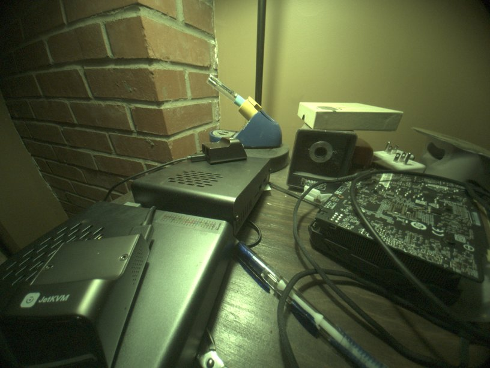
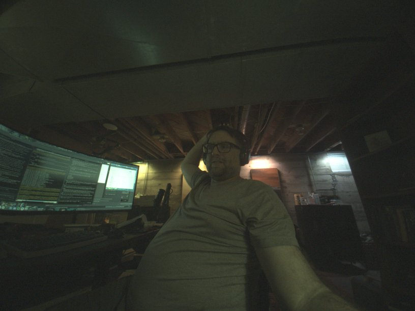

# Phase 11: cameras — CAMSS on SM8450 and a first frame from the ultrawide

Decision record: `docs/architecture/001-camera-stack-mainline-camss.md`.
Measurement record: issue #27. This page is the story of stage 1 and
stage 2, kernels r13 to r23 on 2026-09-21.

## The hardware

Three Hynix sensors on the CCI buses, one lens actuator and one EEPROM on
a GENI I2C bus. Stock switches every sensor rail with a TLMM pin; there is
no PMIC LDO to name, only enables.

| | Rear main | Rear ultrawide | Front |
|---|---|---|---|
| Sensor | Hi1337, 4128x3096 | Hi847, 3264x2448 (stock reads 2896x2176) | Hi1337, 2032x1524 binned |
| I2C | 0x21, CCI0 master 1 | 0x21, CCI0 master 0 | 0x21, CCI1 master 1 |
| CSIPHY | 1 | 2 | 4 |
| MCLK | MCLK3, gpio103 | MCLK1, gpio101 | MCLK4, gpio104 |
| Reset / LDO enable | gpio120 / gpio107 | gpio106 / gpio109 | gpio24 / gpio25 |
| Lens, EEPROM | DW9808 0x0c, P24C256F 0x58 on GENI i2c2 | none, OTP | none, OTP |

All three share the I/O LDO enable on gpio117. MCLK is 19.2 MHz
everywhere. Power-up order on stock: I/O LDO, module LDO, MCLK, reset.
The facts come from the stock device tree and from the CamX sensor-module
binaries in the vendor partition of the stock image, decoded on
2026-09-21 (issue #27).

## Stage 1: CAMSS probes (r13)

Mainline 7.2 has no SM8450 entry in `drivers/media/platform/qcom/camss`,
so the plan was to write the tables from Samsung's GPL 5.10 source. The
register comparison shrank the job. The SM8450 blocks are csiphy-v2.1.0,
csid680 and vfe680, and 7.2 already drives csid680 and vfe680 for the
X1E80100 through `csid_ops_680` and `vfe_ops_680`. The X1E80100 csiphy
lane table is the downstream csiphy 2.1.0 table entry for entry, common
block at 0x1000. What remained was a `CAMSS_8450` version, the resource
tables, the switch cases, a binding and the camss node in `sm8450.dtsi`,
with registers, edge interrupts, GDSCs, SMMU stream IDs and clock rates
from the stock DTB. That is `sm8450-camss.patch`.

Two choices in the tables:

- `vfe_ops_gen3`, which the SM8550 uses, addresses RDI0 as bus write
  master 23. On vfe680 RDI0 to RDI2 are 24 to 26, so the 680 ops are the
  right ones.
- Full VFEs get three lines. The driver registers a fourth line as the
  PIX path, which the 680 ops would map to write master 27, LTM
  statistics on this hardware. Lite VFEs have four RDIs and get four.

The board DTS supplies the two CSIPHY rails (pm8350 L5B 0.88 V and L6B
1.2 V) and enables the node. On the tablet `qcom-camss` autoloads and
`media-ctl -p` lists 6 CSIPHY, 5 CSID, 3 full VFE with rdi0 to rdi2, 2
lite VFE with rdi0 to rdi3, 17 video nodes.

One flash lesson: kernel modules live in the rootfs. `dd` of boot.img
replaces kernel, DTB and initramfs; `/lib/modules` is whatever kernel apk
the rootfs has installed. The first r13 boot had the r2 camss module with
no sm8450 alias and nothing bound until the r13 apk was installed.

## Stage 2: the ultrawide streams (r14)

The mainline Hi847 driver is ACPI-only. `hi847-of.patch` gives it a
`hynix,hi847` compatible, vddio/vdda/vddd regulators, reset and shutdown
GPIOs, and runtime-PM power on and off around the clock, on the pattern of
hi846.c. The power sequence is the stock one: rails, 5 ms, MCLK at
19.2 MHz, 8 ms, reset released, 11 ms. The register tables are untouched;
the stock module's CamX tables differ from mainline's mainly in the sensor
MCU firmware image and in the cropped 2896x2176 window.

The DTS models the rails as two GPIO-switched fixed regulators, the shared
I/O LDO on gpio117 and the ultrawide LDO on gpio109 with the I/O LDO as
its `vin-supply`, which gives the stock enable order for free. `cci0` is
enabled, the sensor sits on `cci0_i2c0` at 0x21 with MCLK1, reset on
gpio106 active low, both link frequencies the driver requires (400 and
200 MHz), and its endpoint is wired to `csiphy2_ep` on the camss node.

On the tablet the sensor probes as `hi847 5-0021` with chip ID 0x0847,
already linked to `msm_csiphy2`. `tools/camtest.sh uw` links csiphy2 to
csid0 to vfe0_rdi0, sets SGRBG10 3264x2448 on every pad and captures with
`v4l2-ctl`: 10-megabyte frames at 29.7 fps, no camss or CSID errors in
dmesg, GDSCs back off afterwards. `tools/raw2png.py` unpacks the frame;
the raw values sit at the 64 black level with a full-range histogram.

*First frame from a mainline kernel on this tablet: the desk from the
ultrawide, half-resolution debayer, percentile stretch, no colour
correction.*

## Stage 2, second half: the second session (r23)

The first session after boot streamed; every later one failed. The camera
GDSC that had collapsed after the session, TITAN_TOP or IFE_0, never
reached power-up complete: `titan_top_gdsc status stuck at 'off'`, GDSCR
0x68282800, CFG_GDSCR 0x010e0000, then -22 on every attempt until a
reboot. A domain that collapsed after CCI traffic alone recovered, and the
lite path with no IFE domain broke TITAN_TOP too.

Eight kernel-side candidates went by, one per flash: the stock
retain-regs flag on the GDSCs, the SM8550 GDSC wait values, downstream's
CAMNOC qchannel handshake, holding the MMCX and MXC rails, collapsing the
IFE before gating its clocks, downstream's CSID path reset and quiesce, a
software-only CSID reset. None changed the outcome. camcc register dumps
in three states (`device-facts/camss-gdsc-2026-09-21/`) showed the
software-visible clock state identical before a working and a failing
power-up, with one exception that read as noise at the time: the RCG
selectors of the streamed clocks stayed on their PLL sources after the
collapse.

The bisect that found it ran at runtime. A module parameter skipped one
step of the VFE power cycle at a time in a throwaway power-up with no
links and no data, then a real stream followed. Skipping only
`vfe_set_clock_rates` made the next stream work. The rate setting is what
moves the camera RCGs from XO onto PLL0 and PLL3, and after the session
those PLLs are off while `ife_0_clk_src`, `csid_clk_src`,
`cphy_rx_clk_src` and `camnoc_axi_clk_src` still select them. The GDSC
power-up sequence waits on domain clocks that never toggle.
`drivers/clk/qcom/clk-rcg2.c` says so in the comment on
`clk_rcg2_shared_init`: an RCG stuck on a dead parent wedges the GDSC
"waiting for the clk status to toggle on when it never does".

camcc-sm8450 registers all 35 RCGs with `clk_rcg2_ops`, which leaves the
configuration in place when the branch goes off. camcc-sm8550 and
camcc-sm8650 use `clk_rcg2_shared_ops` for every RCG, which parks the RCG
on XO while disabled and restores the configuration on enable.
`camcc-sm8450-shared-rcg.patch` switches every SM8450 RCG to the shared
ops. With it, five consecutive sessions on VFE0 and VFE1 stream at 30 fps
and the RCG CFG words read 0 after each session. Stock never hit this
because its 5.10 clock framework parks RCGs on disable.

*The sixth session of that boot: the operator at the desk, taken through
the stack on the day it came together. Default exposure, so dark; the
controls exist and libcamera is where they get driven.*

Two lessons carried into the invariants. Kernel module changes need the
kernel apk installed on the rootfs; boot.img alone does not carry them.
Skipping a clock in a bisect can hang the SoC when a register in that
domain is touched; the two hangs in this hunt came from skipping the CPAS
fast AHB and the VFE core clock while the IFE interrupt handler still ran.

## Next

The lite path (csid3 to vfe3) is untested on the fixed kernel; it hung
the tablet once on the experimental r22 build. Stage 3 is the Hi1337 rear
and front sensors and the DW9808 lens, ported from the Tab S9 out-of-tree
drivers, plus enabling GENI i2c2 for the lens and EEPROM. Stage 4 is libcamera with its software ISP and a Hynix sensor
helper. Open items to confirm while streaming: the vfe_lite register
windows, the interconnect bandwidth values, and which SMMU stream IDs
belong to the SFEs.
